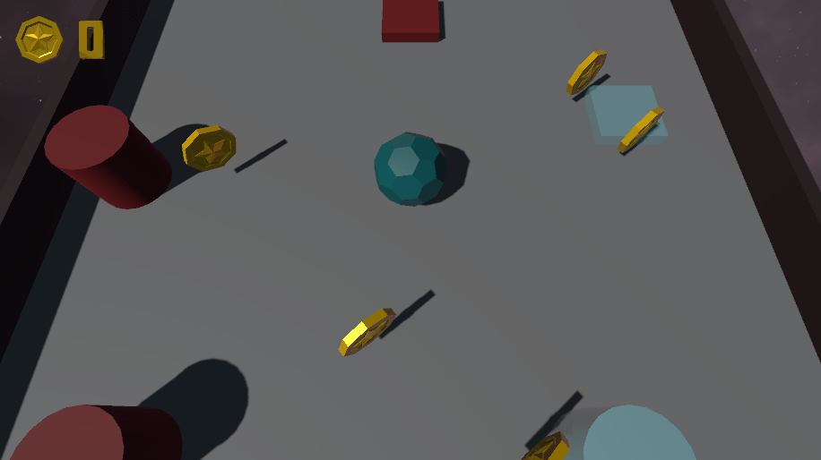

# Them Rolly Bois

Roll the ball and collect all the coins in this Unity game!

---

## RANDOM NOTES

- Solo game.
- The game is one procgen level.
- The goal is to earn as many points as possible, such as with Snake, the Dino game, the Upward-Jumping game...

- Implement a button, anything, to be able to switch the bumper/jumper's activation.

- I want the twin feature: when stepping into some zone, the player duplicates, you now control two balls at once. And when you step into another zone, you go back to being singular. Oh, ok, you know what? Whenever a ball steps into the thingy, it duplicates, so you can find yourself with lots of balls. Of course, you can also merge until you find yourself singular again.
- Any ball can be destroyed, and I want a small explosion (Synty Prototype Pack).
- When a ball is destroyed, the coins it gathered are lost as well.

# GAME FEEL

- https://www.youtube.com/watch?v=LGhkKdud-DQ
- https://www.youtube.com/watch?v=fHQHg7FXmQU&list=PLNoRsahkiuzWgIAVbK9AD1kWtI_8i9s8K&index=17

